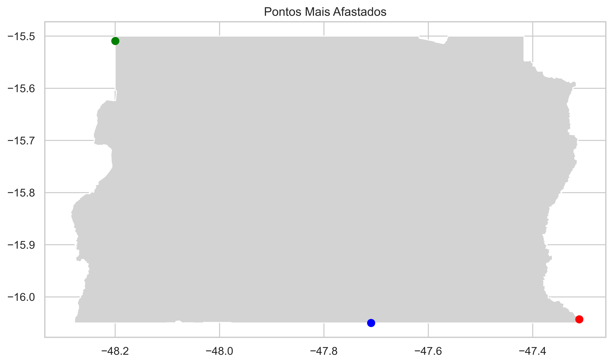

# Relatório de Análise de Entregas da Loggi no Distrito Federal

**Este relatório apresenta uma análise detalhada das entregas realizadas pela empresa Loggi no Distrito Federal (DF). Foram analisados dados geográficos e estatísticos para fornecer insights sobre o volume de entregas, localizações dos hubs, proporções de entregas por região e sugestões de investimento em veículos personalizados de acordo com as características de cada hub.**

## Análise Inicial de Dados
Foram fornecidos três conjuntos de dados principais:

1. `geo_deliveries_df`: Contém informações sobre as entregas, incluindo as coordenadas geográficas das localizações dos hubs e dos pontos de entrega.

2. `deliveries_df`: Contém dados detalhados sobre as entregas, incluindo a região do hub correspondente e outras informações relevantes.

3. `data`: Contém informações adicionais sobre as entregas em cada região.

## Análise de Volume de Entregas por Região
Foi realizada uma análise para verificar o volume de entregas em cada região do Distrito Federal. Os dados revelaram que a região DF-1, que inclui Brasília (Plano Piloto), é a mais movimentada, com a maior concentração de entregas. Já a região DF-0 possui a menor densidade populacional, mas abrange a maior parte das áreas rurais e mais afastadas.

A visualização em gráfico de barras apresenta a proporção de entregas por região:

## Investimento Proporcional em Veículos Personalizados
Com base na demanda de cada hub e nas características das entregas, foi proposto um investimento proporcional em veículos personalizados. Foi considerada a proporção de entregas de cada hub em relação ao total e a capacidade de cada tipo de veículo. O investimento proporcional foi distribuído da seguinte forma:

- Carros de Estrada: Foram direcionados para atender a maioria das entregas em todas as regiões.
- Caminhões: Foi direcionado apenas para o hub DF-0, que possui entregas em estradas de chão e longas distâncias.
- Motos: Foram direcionadas para atender às demandas dos hubs DF-1 e DF-2, que são mais urbanizados e com entregas de menor distância.

O gráfico de barras agrupadas ilustra o investimento proporcional em cada tipo de veículo para cada hub:

## Análise das Distâncias de Entrega por Hub
Foi realizada uma análise das distâncias médias de entrega para cada hub. Os resultados mostraram que o hub DF-1 tem a menor distância média de entrega, indicando que a maioria das entregas nessa região está localizada em uma área mais central e densamente povoada. Por outro lado, o hub DF-0 apresenta a maior distância média de entrega, indicando entregas mais dispersas em áreas rurais e mais afastadas.

O gráfico de barras apresenta a média das distâncias de entrega por hub:

## Pontos Mais Afastados
Foi realizada uma análise dos pontos de entrega mais afastados de cada hub. Os resultados são mostrados no mapa, onde a cor dos pontos de entrega indica a região do hub correspondente.

Mapa dos Pontos Mais Afastados:

## Conclusão
A análise detalhada dos dados de entregas da Loggi no Distrito Federal proporcionou insights valiosos para a otimização da logística e alocação de recursos. As informações sobre as proporções de entregas por região e as distâncias médias de entrega em cada hub permitem que a empresa adapte suas operações e ofereça serviços mais eficientes aos clientes.

O investimento proporcional em veículos personalizados com base nas necessidades de cada hub e a análise dos pontos mais afastados auxiliam na alocação eficiente de recursos e garantem que a Loggi alcance todas as áreas de forma adequada, considerando as características geográficas e demandas específicas de cada região.
